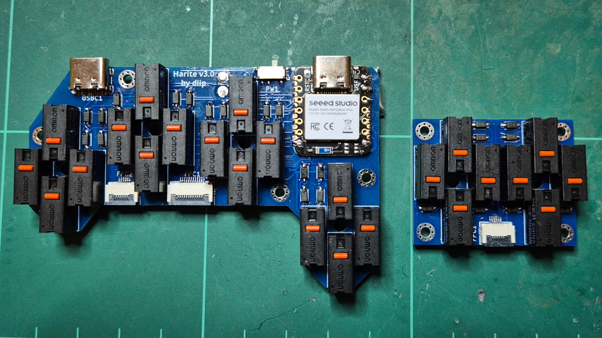
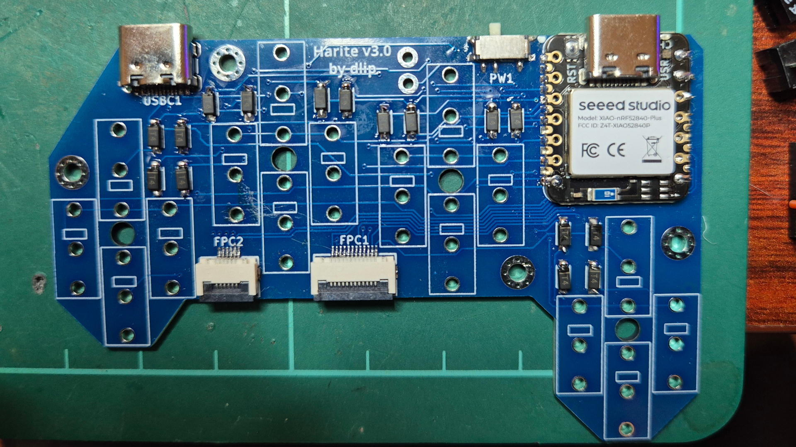
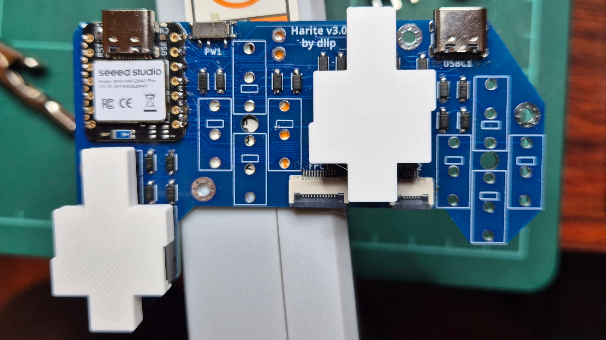
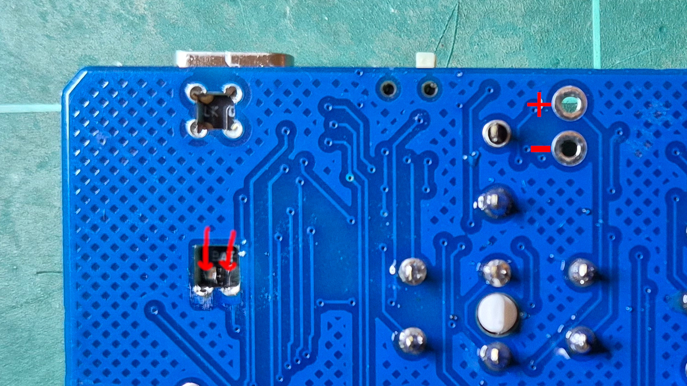
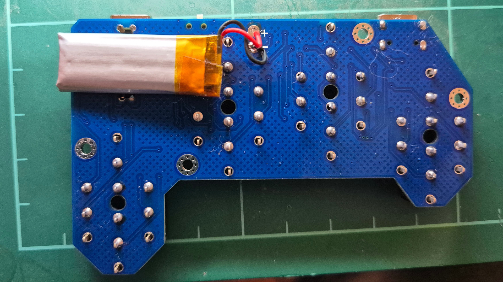

# Build

## Firmware

- [ZMK](https://github.com/dlip/zmk-harite-v3)

## Main PCB and Thumb Cluster

I am using [JLCPCB](https://jlcpcb.com) to manufacture my PCBs, they have a 5 minimum quantity but its still only a few dollars plus shipping.
You can upload the .zip file which contains the Gerber files to get a quote.
The default settings should mostly be ok, I like to remove the mark on PCB.
You can also get them to assemble the PCB (other than the mouse switches and Xiao MCU) by checking that option and using bom.csv for the BOM and positions.csv for the CPL files.

### PCB

| Name          | Qty | Link                                                 |
| ------------- | --- | ---------------------------------------------------- |
| Left PCB      | 1   | [Production Files](./kicad/left/production)          |
| Right PCB     | 1   | [Production Files](./kicad/right/production)         |
| Thumb Cluster | 2   | [Production Files](./kicad/thumb-cluster/production) |

### Main PCB and Thumb Cluster Components

| Name                                                                              | Qty | Link                                                                                              |
| --------------------------------------------------------------------------------- | --- | ------------------------------------------------------------------------------------------------- |
| Seeed Studio XIAO nRF52840 Plus                                                   | 2   | <https://www.seeedstudio.com/Seeed-Studio-XIAO-nRF52840-Plus-p-6359.html>                         |
| 1N4148W diodes                                                                    | 48  | <https://lcsc.com/product-detail/Switching-Diodes_JSMSEMI-1N4148W_C917030.html>                   |
| JUSHUO AFC01-S06FCC-00                                                            | 4   | <https://www.lcsc.com/product-detail/Others_JUSHUO-AFC01-S06FCC-00_C262262.html>                  |
| JUSHUO AFC01-S12FCC-00                                                            | 2   | <https://www.lcsc.com/product-detail/Others_JUSHUO-AFC01-S12FCC-00_C262268.html>                  |
| msk12c02 power switch                                                             | 2   | <https://lcsc.com/product-detail/Slide-Switches_SHOU-HAN-MSK12C02_C431540.html>                   |
| 6 pin FFC cable 0.5 pitch 6cm length type-A (forward direction/same side contact) | 2   | <https://www.aliexpress.com/item/10000013182312.html>                                             |
| 301230 3.7v 110mAh Lithium battery (If wireless)                                  | 2   | <https://www.aliexpress.com/item/4000174322578.html>                                              |
| HRO TYPE-C-31-M-12 USB C female ports (If wired)                                  | 2   | <https://lcsc.com/product-detail/USB-Connectors_Korean-Hroparts-Elec-TYPE-C-31-M-12_C165948.html> |

### Main PCB and Thumb Cluster 3D Printed Parts

| Name           | Qty | Layer Height | Infill | Supports | Link                                                                                                                                                                                                  |
| -------------- | --- | ------------ | ------ | -------- | ----------------------------------------------------------------------------------------------------------------------------------------------------------------------------------------------------- |
| Switch Aligner | 2   | 0.2mm        | 10%    | No       | [Step](https://github.com/dlip/harite-v3/blob/main/freecad/thumb-cluster-switch-aligner-print.step) [Stl](https://github.com/dlip/harite-v3/blob/main/freecad/thumb-cluster-switch-aligner-print.stl) |

### Mouse switches

You'll need 48 switches, I am using the Omron D2FC-F-7N(60M). The actuation force of the switch with the joystick is a lot lower than the direct force since its like a lever that increases the force using torque.

There are almost limitless mouse switch options out there, but here are the ones I have tried:

| Name                 | Feel     | Grams Force (Direct/with Joystick) | Lifetime | Price Each (AUD) | Opinion                                        | Link                                                                                            |
| -------------------- | -------- | ---------------------------------- | -------- | ---------------- | ---------------------------------------------- | ----------------------------------------------------------------------------------------------- |
| Omron D2FC-F-7N(20M) | Clicky   | 55-60/35-40                        | 20M      | 66c              | Nice tactile feedback, but a bit noisy         | <https://www.aliexpress.com/item/1005007380527962.html>                                         |
| Omron D2FC-F-7N(60M) | as above | as above                           | 60M      | 76c              | as above                                       | <https://lcsc.com/product-detail/Limit-Switches_Omron-Electronics-D2FC-F-7N-60M_C19843888.html> |
| Huano Silent Browns  | Tactile  | 55-60/35-40                        | 100M     | 59c              | The feedback is a bit soft, but nice and quiet | <https://www.aliexpress.com/item/1005005219221748.html>                                         |

This spreadsheet also has a lot of switch information:
<https://docs.google.com/spreadsheets/d/1rakrmya3t4Ug3CKKbmKFzF8a9IfdhF7tsud8W1-bz20>

This video tests a lot of switches actuation force
<https://www.youtube.com/watch?v=SayM06qyLrA&t=406s&ab_channel=Ents>

### Soldering

- Start by soldering the main board's FPC and USB connectors. They are the most challenging, and reasonably cheap so if you mess them up you can use one of your spare boards.
- Continue to the power switch and diodes. Ensure the line on the diode matches the side of the line on the board.
- Continue to the Seeed XIAO. I add solder to all the top pads, including the battery ones first, then solder one connector and ensure it is straight. You can skip soldering the 3 smaller castellated connectors on the bottom left if you like.
  

- For the switches use the switch aligners to help ensure they are straight and evenly spaced. The reason for 2 is so you can have an even surface when you are applying pressure and soldering.
  

- Finish by soldering the battery wires to the + (red) and - (black) connectors on the back, and the 2 power pads in the middle at the bottom of the Xiao, being careful not to bridge them.
  

- Solder the thumb cluster in a similar fashion, starting with the FPC connector, then diodes, then switches
- Connect the thumb cluster to the main PCB with the FFC cable
- Flash the firmware and test
